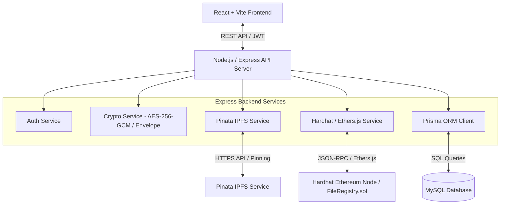
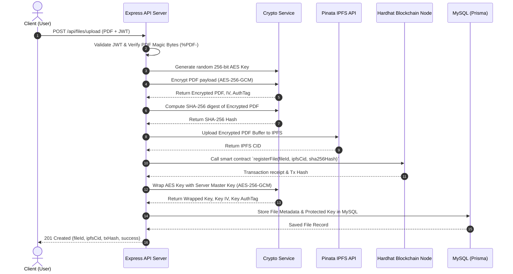
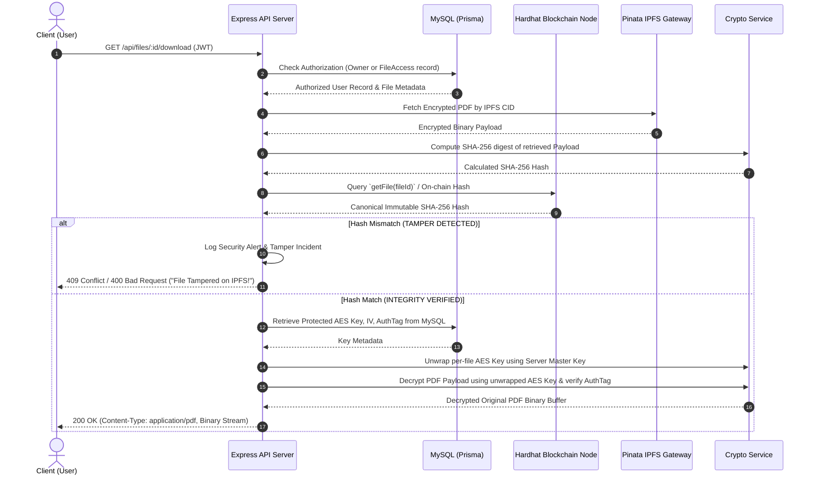

# System Architecture Document

## 1. High-Level System Architecture

The architecture follows a multi-tier hybrid decentralized pattern combining:
- **Client Tier:** Single Page Application (React + Vite + Tailwind CSS).
- **Application Tier:** REST API Server (Node.js + Express.js) managing authentication, business logic, key envelope management, cryptographic processing, and external orchestration.
- **Relational Storage Tier:** MySQL database accessed via Prisma ORM for relational application state, user management, file metadata, and protected AES key parameters.
- **Decentralized File Storage Tier:** InterPlanetary File System (IPFS) via Pinata API for immutable decentralized storage of encrypted PDF binaries.
- **Decentralized Ledger Tier:** Ethereum-compatible blockchain (Hardhat Node) hosting the `FileRegistry.sol` smart contract for immutable metadata registration and tamper verification.

---

## 2. Component Architecture & Layered Responsibilities

### 2.1 Frontend (Client Tier)
- **UI Views:** Login, Register, Dashboard, Upload File Modal, File List, Access Management Modal, Integrity Verification Status Badge.
- **State Management & HTTP:** React Context / Axios for API requests, storing JWT in safe local storage or memory.
- **Validation:** Pre-flight client-side file type (`.pdf`) and size check.

### 2.2 Backend (Application Tier)
- **Controller Layer (`/routes`, `/controllers`):** Express handlers parsing input, managing standard REST responses, HTTP status codes, and error middleware.
- **Middleware Layer (`/middleware`):** `auth.middleware.js` (JWT verification & RBAC check), `upload.middleware.js` (Multer memory buffer parsing & PDF header verification).
- **Service Layer (`/services`):**
  - **`crypto.service.js`:** 
    - Generates 256-bit AES keys.
    - Encrypts/decrypts PDF buffers with AES-256-GCM (producing cipher, IV, authTag).
    - Wraps/unwraps per-file AES keys using server `MASTER_ENCRYPTION_KEY`.
    - Generates SHA-256 binary digests.
  - **`ipfs.service.js`:** Interacts with Pinata API to pin encrypted file buffers and unpin/retrieve content.
  - **`blockchain.service.js`:** Wraps `ethers.js` wallet/provider to invoke `FileRegistry.sol` smart contract methods (`registerFile`, `getFile`, `verifyHash`).
  - **`file.service.js`:** Orchestrates upload & download pipelines combining crypto, IPFS, blockchain, and Prisma database logic.

---

## 3. Sequence Diagrams

### 3.1 File Upload & Registration Sequence

---

### 3.2 File Download & Tamper Verification Sequence

---

## 4. Key Architectural Decisions & Safeguards

| Decision Area | Technical Choice | Security Rationale |
| :--- | :--- | :--- |
| **File Encryption** | AES-256-GCM | Authenticated Encryption with Associated Data (AEAD); protects payload against ciphertext modification. |
| **Key Management** | Envelope Encryption | Per-file keys wrapped using server `MASTER_ENCRYPTION_KEY`. Raw keys never stored on disk or DB. |
| **Blockchain Role** | Immutable Hash Registry | Blockchain stores only hashes and CIDs; no raw keys, no document contents. Off-chain state stored in MySQL. |
| **Pre-decryption Check** | SHA-256 comparison vs Blockchain | Guarantees that tampered IPFS payloads are detected and dropped BEFORE attempting decryption. |
| **Database ORM** | Prisma + MySQL | Type-safe queries, migration control, strict relational mapping for access control. |
