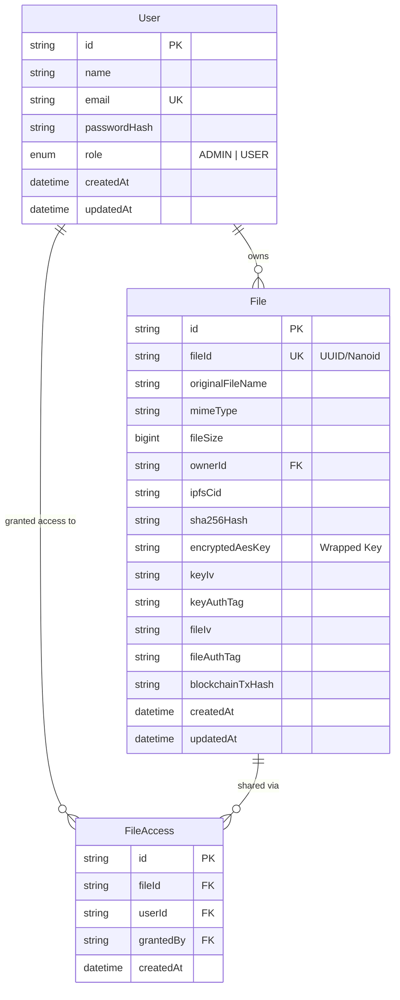

# Database Design Document

## 1. Overview & Technology Stack
- **Database Engine:** MySQL 8.0+
- **ORM:** Prisma ORM v5+
- **Primary Design Goals:** Strict relational integrity, role-based security, comprehensive metadata tracking for cryptographic key wrapping, and access control lists (ACL).

---

## 2. Entity-Relationship Model (ERD)



---

## 3. Detailed Data Dictionary

### 3.1 `User` Table
Stores registered platform users and authorization levels.

| Column | Type | Constraints | Description |
| :--- | :--- | :--- | :--- |
| `id` | VARCHAR(36) | PRIMARY KEY, default UUID | Unique internal user identifier |
| `name` | VARCHAR(255) | NOT NULL | User full name |
| `email` | VARCHAR(255) | UNIQUE, NOT NULL | User login email address |
| `passwordHash` | VARCHAR(255) | NOT NULL | Bcrypt hashed password (12 rounds) |
| `role` | ENUM('ADMIN', 'USER') | DEFAULT 'USER', NOT NULL | Role-based permission tier |
| `createdAt` | DATETIME(3) | DEFAULT CURRENT_TIMESTAMP(3) | Record creation timestamp |
| `updatedAt` | DATETIME(3) | UPDATED AT | Record last update timestamp |

### 3.2 `File` Table
Stores file metadata, cryptographic initialization vectors, authentication tags, wrapped encryption keys, IPFS CIDs, and Blockchain transaction references.

| Column | Type | Constraints | Description |
| :--- | :--- | :--- | :--- |
| `id` | VARCHAR(36) | PRIMARY KEY, default UUID | Internal record identifier |
| `fileId` | VARCHAR(64) | UNIQUE, NOT NULL | Public file identifier (used in smart contract) |
| `originalFileName` | VARCHAR(255) | NOT NULL | Original uploaded PDF filename |
| `mimeType` | VARCHAR(100) | DEFAULT 'application/pdf' | Validated file MIME type |
| `fileSize` | BIGINT | NOT NULL | Encrypted file size in bytes |
| `ownerId` | VARCHAR(36) | NOT NULL, FK(`User.id`) | Foreign key referencing file owner |
| `ipfsCid` | VARCHAR(255) | NOT NULL | Pinata IPFS Content Identifier |
| `sha256Hash` | VARCHAR(64) | NOT NULL | Hex SHA-256 digest of encrypted PDF |
| `encryptedAesKey` | TEXT | NOT NULL | Per-file AES key encrypted with Server Master Key |
| `keyIv` | VARCHAR(64) | NOT NULL | Hex IV used during key wrapping |
| `keyAuthTag` | VARCHAR(64) | NOT NULL | Hex Auth Tag from key wrapping (GCM) |
| `fileIv` | VARCHAR(64) | NOT NULL | Hex IV used during PDF payload encryption |
| `fileAuthTag` | VARCHAR(64) | NOT NULL | Hex Auth Tag from PDF payload encryption (GCM) |
| `blockchainTxHash` | VARCHAR(255) | NOT NULL | Ethereum transaction hash of on-chain registration |
| `createdAt` | DATETIME(3) | DEFAULT CURRENT_TIMESTAMP(3) | Record creation timestamp |
| `updatedAt` | DATETIME(3) | UPDATED AT | Record last update timestamp |

### 3.3 `FileAccess` Table
Granular access control entries for shared files.

| Column | Type | Constraints | Description |
| :--- | :--- | :--- | :--- |
| `id` | VARCHAR(36) | PRIMARY KEY, default UUID | Access entry identifier |
| `fileId` | VARCHAR(36) | NOT NULL, FK(`File.id`) | Reference to shared file |
| `userId` | VARCHAR(36) | NOT NULL, FK(`User.id`) | Reference to recipient user |
| `grantedBy` | VARCHAR(36) | NOT NULL, FK(`User.id`) | Owner who granted access |
| `createdAt` | DATETIME(3) | DEFAULT CURRENT_TIMESTAMP(3) | Access grant timestamp |

---

## 4. Prisma Schema Definition (`prisma/schema.prisma`)

```prisma
datasource db {
  provider = "mysql"
  url      = env("DATABASE_URL")
}

generator client {
  provider = "prisma-client-js"
}

enum Role {
  ADMIN
  USER
}

model User {
  id           String       @id @default(uuid())
  name         String
  email        String       @unique
  passwordHash String
  role         Role         @default(USER)
  createdAt    DateTime     @default(now())
  updatedAt    DateTime     @updatedAt

  ownedFiles   File[]       @relation("FileOwner")
  accessGrants FileAccess[] @relation("GrantedToUser")
  givenGrants  FileAccess[] @relation("GrantedByUser")

  @@map("users")
}

model File {
  id               String       @id @default(uuid())
  fileId           String       @unique
  originalFileName String
  mimeType         String       @default("application/pdf")
  fileSize         BigInt
  ownerId          String
  ipfsCid          String
  sha256Hash       String
  encryptedAesKey  String       @db.Text
  keyIv            String
  keyAuthTag       String
  fileIv           String
  fileAuthTag      String
  blockchainTxHash String
  createdAt        DateTime     @default(now())
  updatedAt        DateTime     @updatedAt

  owner            User         @relation("FileOwner", fields: [ownerId], references: [id], onDelete: Cascade)
  accessRules      FileAccess[]

  @@index([ownerId])
  @@index([fileId])
  @@map("files")
}

model FileAccess {
  id        String   @id @default(uuid())
  fileId    String
  userId    String
  grantedBy String
  createdAt DateTime @default(now())

  file      File     @relation(fields: [fileId], references: [id], onDelete: Cascade)
  user      User     @relation("GrantedToUser", fields: [userId], references: [id], onDelete: Cascade)
  grantor   User     @relation("GrantedByUser", fields: [grantedBy], references: [id], onDelete: Cascade)

  @@unique([fileId, userId])
  @@map("file_access")
}
```

---

## 5. Security & Migration Rules
1. **Plaintext Protection:** Plaintext AES keys are strictly forbidden from DB fields. `encryptedAesKey` contains strictly cipher text.
2. **Cascading Deletes:** Deleting a user cleans up owned files and file access grants safely.
3. **Database Migration Strategy:** Executed via `npx prisma migrate dev --name init` during setup.
