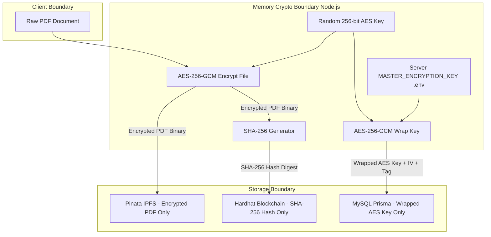

# Security Design Document

## 1. Executive Security Architecture

Security in this system is designed around **Defense-in-Depth**, zero-trust storage, and **Envelope Key Wrapping**. The architecture ensures that even if external components (such as public IPFS nodes or database backups) are compromised or intercepted by hostile actors, confidentiality and integrity remain completely uncompromised.



---

## 2. Enforced 10 Mandatory Security Rules

| # | Security Rule | Implementation Mechanism | Verification Check |
| :--- | :--- | :--- | :--- |
| **1** | **Random Per-File AES Key** | `crypto.randomBytes(32)` invoked per upload. | Unique key generated for every upload transaction. |
| **2** | **AES-256-GCM Encryption** | Encrypts PDF buffer using 96-bit random IV and returns 128-bit Auth Tag. | Prevents cipher-text bit-flipping attacks. |
| **3** | **IPFS Stores Encrypted Payload Only** | Strictly raw encrypted binary buffer passed to Pinata API. | Public IPFS viewers only see high-entropy encrypted ciphertext. |
| **4** | **SHA-256 Digest Calculation** | `crypto.createHash('sha256').update(encryptedPayload)` | Computes hash of encrypted binary prior to pinning. |
| **5** | **On-Chain Hash Registration** | `FileRegistry.registerFile(fileId, ipfsCid, sha256Hash)` | Blockchain stores immutable checksum reference. |
| **6** | **Server Master Key Wrapping** | Per-file key is encrypted using `MASTER_ENCRYPTION_KEY` via AES-256-GCM. | Plaintext AES key exists in Node memory for <10ms. |
| **7** | **Protected Key in MySQL** | Stores `encryptedAesKey`, `keyIv`, `keyAuthTag` in `File` record. | MySQL database dump contains no readable file keys. |
| **8** | **Master Key Exposure Prevention** | Stored in system process `.env`; never returned in API responses or logs. | API DTO strip key fields; unit tests verify exclusion. |
| **9** | **Zero Plaintext Key Storage** | DB schema has no raw key column; memory buffer cleared post-op. | Automated static linting / DB checks. |
| **10** | **Zero PDF Content on Blockchain** | Only 32-byte hash & string CID stored in Solidity struct. | Gas optimization & zero data leakage on-chain. |

---

## 3. Cryptographic Implementation Details (`CryptoService.js`)

### 3.1 Primitives & Parameters
- **Symmetric Cipher:** AES-256-GCM (Galois/Counter Mode).
- **Key Length:** 256 bits (32 bytes).
- **Initialization Vector (IV):** 96 bits (12 bytes), generated via `crypto.randomBytes(12)`.
- **Authentication Tag:** 128 bits (16 bytes).
- **Checksum:** SHA-256 (Hex string output, 64 characters).

### 3.2 Key Envelope & Encryption Workflow Code

```javascript
const crypto = require("crypto");

class CryptoService {
  constructor() {
    const masterHex = process.env.MASTER_ENCRYPTION_KEY;
    if (!masterHex || masterHex.length !== 64) {
      throw new Error("FATAL: MASTER_ENCRYPTION_KEY must be a 64-character hex string (32 bytes)");
    }
    this.masterKey = Buffer.from(masterHex, "hex");
  }

  /**
   * Generates a random 256-bit AES key.
   */
  generateFileKey() {
    return crypto.randomBytes(32);
  }

  /**
   * Encrypts a PDF buffer using AES-256-GCM.
   */
  encryptFile(pdfBuffer, fileKey) {
    const iv = crypto.randomBytes(12);
    const cipher = crypto.createCipheriv("aes-256-gcm", fileKey, iv);
    
    const encrypted = Buffer.concat([cipher.update(pdfBuffer), cipher.final()]);
    const authTag = cipher.getAuthTag();

    return {
      encryptedBuffer: encrypted,
      fileIvHex: iv.toString("hex"),
      fileAuthTagHex: authTag.toString("hex")
    };
  }

  /**
   * Wraps (encrypts) the per-file AES key using the Server Master Key.
   */
  wrapKey(fileKey) {
    const keyIv = crypto.randomBytes(12);
    const cipher = crypto.createCipheriv("aes-256-gcm", this.masterKey, keyIv);
    
    const wrappedKey = Buffer.concat([cipher.update(fileKey), cipher.final()]);
    const keyAuthTag = cipher.getAuthTag();

    return {
      encryptedAesKeyHex: wrappedKey.toString("hex"),
      keyIvHex: keyIv.toString("hex"),
      keyAuthTagHex: keyAuthTag.toString("hex")
    };
  }

  /**
   * Unwraps (decrypts) the per-file AES key using the Server Master Key.
   */
  unwrapKey(encryptedAesKeyHex, keyIvHex, keyAuthTagHex) {
    const wrappedKey = Buffer.from(encryptedAesKeyHex, "hex");
    const keyIv = Buffer.from(keyIvHex, "hex");
    const keyAuthTag = Buffer.from(keyAuthTagHex, "hex");

    const decipher = crypto.createDecipheriv("aes-256-gcm", this.masterKey, keyIv);
    decipher.setAuthTag(keyAuthTag);

    return Buffer.concat([decipher.update(wrappedKey), decipher.final()]);
  }

  /**
   * Decrypts an encrypted PDF buffer using the unwrapped file key.
   */
  decryptFile(encryptedBuffer, fileKey, fileIvHex, fileAuthTagHex) {
    const fileIv = Buffer.from(fileIvHex, "hex");
    const fileAuthTag = Buffer.from(fileAuthTagHex, "hex");

    const decipher = crypto.createDecipheriv("aes-256-gcm", fileKey, fileIv);
    decipher.setAuthTag(fileAuthTag);

    return Buffer.concat([decipher.update(encryptedBuffer), decipher.final()]);
  }

  /**
   * Computes SHA-256 digest of binary buffer.
   */
  computeSha256(buffer) {
    return crypto.createHash("sha256").update(buffer).digest("hex");
  }
}

module.exports = new CryptoService();
```

---

## 4. Pre-Decryption Tamper Detection Logic

During the download request flow, the system enforces a strict **fail-closed check** prior to decrypting or unwrapping keys:

```javascript
// Step 1: Fetch binary payload from IPFS gateway
const encryptedBinaryFromIPFS = await ipfsService.fetchFile(fileRecord.ipfsCid);

// Step 2: Calculate actual SHA-256 hash of retrieved payload
const calculatedHash = cryptoService.computeSha256(encryptedBinaryFromIPFS);

// Step 3: Fetch canonical on-chain hash from FileRegistry smart contract
const { sha256Hash: onChainHash, isActive } = await blockchainService.getOnChainFile(fileRecord.fileId);

// Step 4: Validate Active status & Compare Hashes
if (!isActive) {
  throw new SecurityError("FILE_DEACTIVATED", "The requested file has been deactivated on blockchain.");
}

if (calculatedHash.toLowerCase() !== onChainHash.toLowerCase()) {
  // CRITICAL SECURITY EVENT: File modified on IPFS network!
  logger.error(`[SECURITY ALERT] Tamper detected for fileId ${fileRecord.fileId}! Calculated: ${calculatedHash}, OnChain: ${onChainHash}`);
  throw new SecurityError("INTEGRITY_VIOLATION", "TAMPER_DETECTED: Encrypted payload on IPFS does not match blockchain SHA-256 checksum.");
}

// Step 5: Decryption ONLY occurs if hashes match 100%
const fileKey = cryptoService.unwrapKey(fileRecord.encryptedAesKey, fileRecord.keyIv, fileRecord.keyAuthTag);
const originalPdfBuffer = cryptoService.decryptFile(encryptedBinaryFromIPFS, fileKey, fileRecord.fileIv, fileRecord.fileAuthTag);
```

---

## 5. Threat Modeling (STRIDE Framework)

| STRIDE Threat | Risk Level | Mitigation Strategy in Design |
| :--- | :--- | :--- |
| **Spoofing** | High | JWT session tokens signed with `JWT_SECRET`; bcrypt 12-round password hashing. |
| **Tampering** | Critical | SHA-256 checksum recorded on immutable Hardhat blockchain node. IPFS payload modified by attacker fails pre-decryption check. |
| **Repudiation** | Medium | Immutable `FileRegistered` event emitted on Ethereum blockchain with caller address & block timestamp. |
| **Information Disclosure** | Critical | Encrypted PDF binaries on IPFS are unreadable without key. Per-file AES keys wrapped with Master Key in MySQL. |
| **Denial of Service** | Medium | Multer strict file size limit (50MB), Express `express-rate-limit` middleware. |
| **Elevation of Privilege** | High | Role-based middleware (`ADMIN`, `USER`) + strict owner/ACL verification on every download route. |
